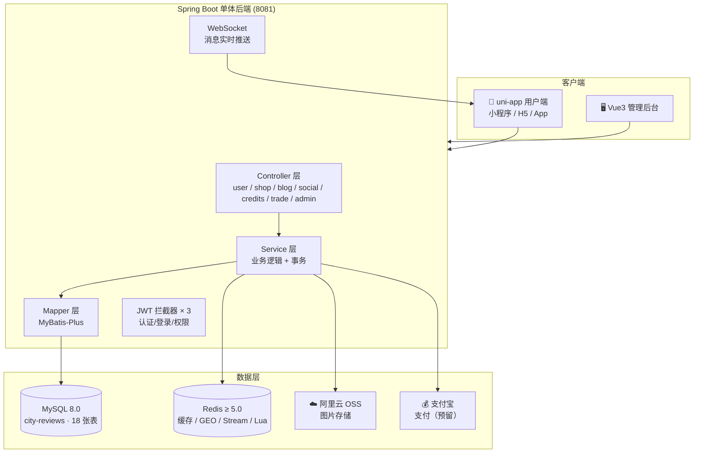
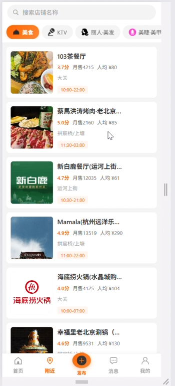
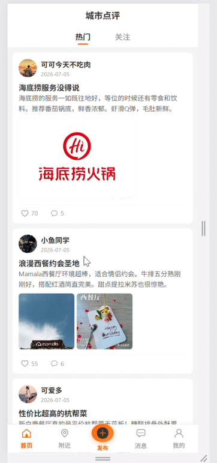
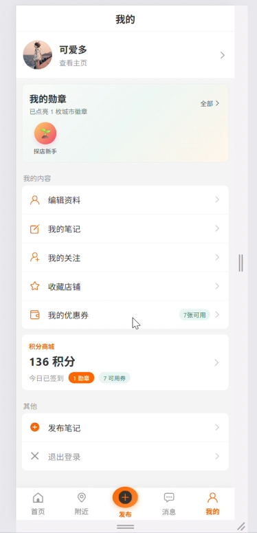
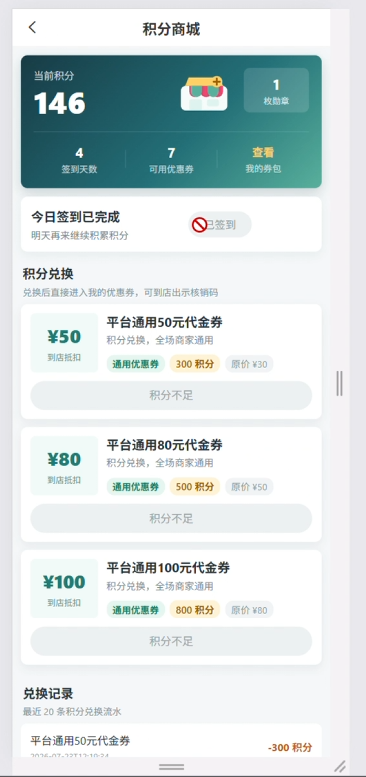
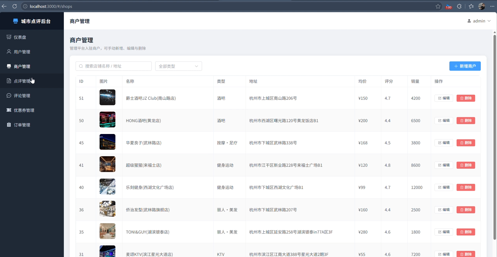

<div align="center">

# 🏙️ 城市点评系统 · City Review

> 一个基于 **Spring Boot 3 + Redis + uni-app** 的本地生活探店点评平台，
> 覆盖用户端小程序/H5、管理后台与后端服务三端完整闭环。


</div>

---

## 📖 项目简介

**城市点评系统** 是一个仿大众点评/小红书风格的本地生活探店平台。用户可以浏览城市商户、发布探店笔记、点赞评论、关注好友、查看附近好店；平台内置 **优惠券秒杀、积分商城、勋章成长体系** 等营销玩法，并配套完整的 **Web 管理后台**，支持数据看板、内容审核与订单管理。

项目采用 **前后端分离** 架构：

| 端 | 技术 | 说明 |
| --- | --- | --- |
| 📱 用户端 | uni-app (Vue 3) | 一套代码多端发布：微信小程序 / H5 / Android / iOS，推荐 HBuilderX 运行 |
| 🖥️ 管理后台 | Vue 3 + Vite + Element Plus | 数据可视化（ECharts）与运营管理 |
| ⚙️ 后端服务 | Spring Boot 3.5 + MyBatis-Plus | 单体应用，唯一外部依赖组件为 **Redis**（含 Redis Stream 消息队列） |

---

## ✨ 功能特性

### 👤 用户端（uni-app）

- **账号体系**：短信验证码 / 密码登录、注册、JWT 鉴权、Token 黑名单登出
- **商户浏览**：店铺分类、店铺详情（Redis 缓存）、搜索（热门搜索 + 个人搜索历史）
- **附近好店**：基于 Redis GEO 的周边商户距离查询
- **探店笔记**：发布/浏览笔记、点赞（Redis Set 去重 + ZSet 点赞排行 Top5）、评论与二级回复
- **社交关系**：关注/取关、共同关注、关注 Feed 流（ZSet 推模式 + 滚动分页）、粉丝统计
- **消息通知**：WebSocket 实时推送（点赞、评论、关注、系统通知）
- **营销玩法**：
  - 🎟️ **优惠券秒杀**：Redis Lua 原子扣库存 + Redis Stream 异步下单 + Redisson 分布式锁防超卖/一人一单
  - 💰 **积分商城**：签到、发文/获赞/登录/关注得积分，积分兑换优惠券
  - 🏅 **勋章体系**：按发文数、获赞数、粉丝数、签到天数、积分自动解锁勋章
- **订单与支付**：订单状态机（待支付/已支付/已取消/已核销/已退款）、支付宝下单（预留）

### 🛠️ 管理后台（Vue3 + Element Plus）

- 📊 **数据看板**：用户/商户/订单/内容多维统计（ECharts 趋势图）
- 👥 **用户管理**：用户列表、封禁/删除
- 🏪 **商户管理**：商户与分类的增删改查
- 📝 **内容管理**：点评笔记与评论的审核、置顶、隐藏、删除
- 🎫 **营销管理**：优惠券与秒杀场次配置、订单查询

### ⚙️ 后端技术亮点

| 场景 | 方案 |
| --- | --- |
| 缓存 | Redis 缓存商铺详情，`CacheClient` 封装穿透/击穿/雪崩防护（空值缓存 + 逻辑过期 + 互斥锁） |
| 分布式 ID | 基于 Redis 的全局唯一 ID 生成器（时间戳 31 位 + 序列号 32 位，日 42 亿级） |
| 秒杀 | Lua 脚本原子校验库存与一人一单 → Redis Stream 异步建单 → Redisson 锁兜底 |
| Feed 流 | 关注推送模式：发文即写入粉丝 ZSet，滚动分页避免深翻页 |
| 鉴权 | 三层拦截器：JWT 认证 → 登录校验 → 管理员权限，`UserHolder` ThreadLocal 传递用户 |
| 文件存储 | 阿里云 OSS（配置可替换，密钥不入库） |
| 实时通信 | Spring WebSocket + JWT 握手拦截器，离线消息落库补推 |

---

## 🧱 技术栈

| 分类 | 技术 | 版本 |
| --- | --- | --- |
| 语言 | Java | 17 |
| 后端框架 | Spring Boot | 3.5.16 |
| ORM | MyBatis-Plus (+JSqlParser) | 3.5.17 |
| 缓存/消息 | Redis（Lettuce + Redisson） | ≥ 5.0 |
| 鉴权 | JJWT | 0.13.0 |
| 工具库 | Hutool | 5.8.47 |
| 对象存储 | 阿里云 OSS SDK | 3.18.5 |
| 支付 | 支付宝 SDK（预留） | 4.40.909.ALL |
| 用户端 | uni-app (Vue 3) | — |
| 管理后台 | Vue 3 + Vite + Element Plus + ECharts + Pinia | 4.x / 2.3.12 / 5.4.3 |

---

## 🏗️ 系统架构



---

## 📁 目录结构

```
City-Review-Project
├── src/                          # 🐳 后端（Spring Boot 单体）
│   ├── main/java/com/cn/
│   │   ├── controller/           #   REST 接口（user/shop/content/social/credits/trade/admin）
│   │   ├── service/              #   业务层接口与实现
│   │   ├── mapper/               #   MyBatis-Plus Mapper
│   │   ├── entity/               #   实体类（与 18 张表对应）
│   │   ├── dto/                  #   数据传输对象（Result/LoginFormDTO 等）
│   │   ├── config/               #   配置类（Redis/OSS/WebSocket/拦截器/跨域）
│   │   ├── utils/                #   工具（JWT/密码/ID 生成器/缓存客户端/拦截器）
│   │   └── ws/                   #   WebSocket 处理器与握手拦截器
│   └── main/resources/
│       ├── application-example.yaml  # 📋 配置模板（真实配置不入库）
│       ├── seckill.lua               #   秒杀 Lua 脚本（原子扣库存）
│       └── mapper/                   #   XML 映射
├── uni-app-project/              # 📱 用户端（uni-app，Vue 3）
│   └── pages/                    #   首页/登录/店铺详情/笔记详情/发布/秒杀/积分商城/勋章墙…
├── admin-panel/                  # 🖥️ 管理后台（Vue 3 + Element Plus）
│   └── src/views/                #   看板/用户/商户/点评/评论/优惠券/订单
├── sql/
│   └── city-reviews.sql          # 🗄️ 数据库初始化脚本（建库建表 + 示例数据）
├── pom.xml                       # Maven 构建配置
└── README.md
```

---

## 🚀 快速开始

### 0️⃣ 环境要求

| 依赖 | 版本 | 说明 |
| --- | --- | --- |
| JDK | 17+ | 后端运行 |
| Maven | 3.6+ | 后端构建 |
| MySQL | 8.0 | 数据库 |
| Redis | **≥ 5.0** | 缓存 / GEO / Stream |
| Node.js | 16+ | 管理后台 |
| HBuilderX | 最新版 | 用户端（推荐） |

### 1️⃣ 初始化数据库

```bash
# 在 MySQL 中创建数据库并导入脚本（脚本内含建库语句与示例数据）
mysql -uroot -p < sql/city-reviews.sql
```

### 2️⃣ 启动 Redis（必须 ≥ 5.0）

```bash
redis-server
```

> ⚠️ **重要：启动后端前，必须先创建 Redis Stream 消费者组**，否则启动报错：
>
> ```bash
> redis-cli
> > XGROUP CREATE stream.orders g1 $ MKSTREAM
> ```

### 3️⃣ 配置并启动后端

```bash
# ① 复制配置模板并填入你自己的数据库/OSS 等配置
cd src/main/resources
copy application.yaml application.yaml   # Windows
# cp application.yaml application.yaml   # Linux/macOS

# ② 启动
mvn spring-boot:run
```

后端默认运行于 `http://localhost:8081`。

### 4️⃣ 启动用户端（uni-app）

用 **HBuilderX** 打开 `uni-app-project` 目录，选择运行到 **浏览器 / 微信开发者工具 / 真机** 即可。

> 用户端接口地址在 `uni-app-project/utils/constants.js` 中配置（默认 `http://localhost:8081`）。

### 5️⃣ 启动管理后台

```bash
cd admin-panel
npm install
npm run dev
```

浏览器访问 `http://localhost:5173`，默认管理员账号：

| 账号 | 密码 |
| --- | --- |
| `admin` | `admin123` |

---

## 🔐 配置说明

真实的 `application.yaml`（含数据库密码、JWT 密钥、阿里云 OSS AccessKey）**已被 `.gitignore` 排除，不会提交到仓库**。仓库仅提供脱敏模板 `application-example.yaml`：

```yaml
spring:
  datasource:
    password: ${DB_PASSWORD}              # 数据库密码
jwt:
  secret: ${JWT_SECRET:your-jwt-secret}   # JWT 签名密钥
aliyun:
  oss:
    access-key-id: ${OSS_ACCESS_KEY_ID}   # 阿里云 AccessKey ID
    access-key-secret: ${OSS_ACCESS_KEY_SECRET}
```

**推荐做法**：使用环境变量注入密钥，避免任何敏感信息进入代码库：

```bash
# Windows PowerShell
$env:DB_PASSWORD="你的数据库密码"
$env:JWT_SECRET="至少32位随机字符串"
$env:OSS_ACCESS_KEY_ID="你的AK"
$env:OSS_ACCESS_KEY_SECRET="你的SK"
```

> 不配置 OSS 不影响项目启动，仅图片上传功能不可用。

---

## 🗄️ 数据库设计（18 张表）

| 模块 | 表 |
| --- | --- |
| 账号体系 | `tb_user`、`tb_user_info`、`tb_admin` |
| 商户 | `tb_shop`、`tb_shop_type` |
| 内容 | `tb_blog`、`tb_blog_comments`、`tb_rating` |
| 社交 | `tb_follow`、`tb_favorite`、`tb_notification` |
| 营销 | `tb_voucher`、`tb_seckill_voucher`、`tb_voucher_order` |
| 积分 | `tb_credits_log`、`tb_credits_exchange`、`tb_badge`、`tb_user_badge` |

---

## 📡 接口概览

| 前缀 | 模块 | 说明 |
| --- | --- | --- |
| `/user` | 用户 | 验证码 / 登录 / 注册 / 资料 / 头像上传 |
| `/shop`、`/shop-type` | 商户 | 详情（缓存）/ 分类 / 附近 GEO |
| `/blog`、`/blog-comments` | 内容 | 笔记 CRUD / 点赞 / 评论 / 关注 Feed |
| `/search` | 搜索 | 笔记搜索 / 热词 / 历史 |
| `/follow`、`/favorite` | 社交 | 关注 / 收藏 |
| `/notification` | 消息 | 通知列表 / WebSocket |
| `/voucher`、`/voucher-order` | 营销 | 优惠券 / 秒杀下单 / 订单状态机 |
| `/credits` | 积分 | 签到 / 明细 / 兑换 / 勋章 |
| `/upload` | 文件 | 图片上传（OSS） |
| `/admin/**` | 管理端 | 登录 / 数据看板 / 各模块管理 |

---

## 📸 项目截图

> 界面截图存放于 `screenshots/` 目录

| 📱 店铺首页 | 📝 笔记首页 | 👤 我的页面 |
| --- | --- | --- |
|  |  |  |

| 💰 积分商城 | 🖥️ 管理后台看板 |
| --- | --- |
|  |  |

---

## ❓ 常见问题

**Q1：启动后端报 `NOGROUP No such key 'stream.orders'`？**
请先执行 `XGROUP CREATE stream.orders g1 $ MKSTREAM` 创建消费者组，详见上文第 2 步。

**Q2：Redis 版本要求？**
必须 **≥ 5.0**（使用了 Redis Stream 与 GEO 特性）。

**Q3：不配置阿里云 OSS 能启动吗？**
能。仅图片上传功能不可用，其余功能不受影响。

**Q4：SQL 脚本里中文注释乱码？**
Navicat 导出编码所致，仅注释乱码，数据与表结构不受影响。

**Q5：管理后台登录不上？**
确认后端已启动且导入过 `city-reviews.sql`，默认账号 `admin / admin123`。

---

## 🤝 贡献

欢迎提交 Issue 与 PR。请保持代码风格统一，涉及 Redis/秒杀等关键逻辑的改动请补充注释说明。

## 📄 许可证

本项目基于 [MIT License](LICENSE) 开源，仅供学习交流使用。
